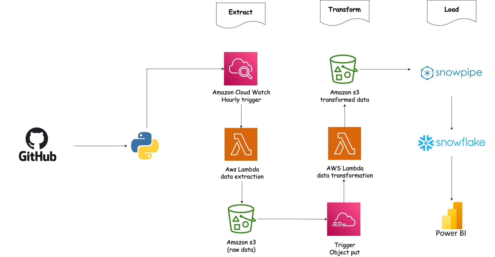

# GitHub ETL Pipeline

*An automated end-to-end data pipeline for GitHub commit analytics.*

## Overview
This project is a fully automated ETL (Extract, Transform, Load) pipeline that pulls commit data from the GitHub API, processes it using AWS Lambda and S3, and loads it into Snowflake for analytics. Built to demonstrate data engineering skills with real-world tools—completed in under 40 minutes!

### Features
- **Extract**: Fetches commit data from GitHub API using Python and a Personal Access Token.  
- **Transform**: Processes raw data with Lambda, adding derived fields like `commit_day`.  
- **Load**: Auto-ingests data into Snowflake via Snowpipe.  
- **Automation**: Runs daily with CloudWatch triggers and S3 event-driven Snowpipe.

## Architecture
  

1. **GitHub API**: Pulls raw commit data (e.g., from `octocat/hello-world`).  
2. **AWS Lambda (Extract)**: Fetches data and stores it as JSON in S3 (`raw_data/`).  
3. **AWS S3**: Holds raw JSON and transformed CSV files (`transformed_data/`).  
4. **AWS Lambda (Transform)**: Processes JSON, adds `commit_day`, and saves as CSV.  
5. **Snowflake Snowpipe**: Loads CSV into `staging.github_commits` automatically.  
6. **AWS CloudWatch**: Triggers the extract Lambda daily.

## Tech Stack
- **Python**: `requests`, `pandas`, `boto3` for API calls, data handling, and AWS integration.  
- **AWS**:  
  - **Lambda**: Serverless extract and transform functions.  
  - **S3**: Storage bucket (`s3://github-etl-bucket/`).  
  - **CloudWatch**: Automation scheduler.  
- **Snowflake**: Data warehouse with Snowpipe for real-time ingestion.

## Setup Instructions

### Prerequisites
- **GitHub API**: Personal Access Token with `public_repo` scope from [GitHub Developer Settings](https://github.com/settings/tokens).  
- **AWS Account**: IAM roles, S3 bucket, and Lambda setup required.  
- **Snowflake Account**: Warehouse and database configured (e.g., `STAGING`).

### AWS Setup
1. **S3 Bucket**:  
   - Create `s3://github-etl-bucket/` with two folders:  
     - `raw_data/`: Stores raw JSON files from GitHub API.  
     - `transformed_data/`: Stores processed CSV files for Snowflake.  

2. **IAM Role**:  
   - **Policy**: Grant S3 read/write permissions:  
     ```json
     {
       "Effect": "Allow",
       "Action": ["s3:GetObject", "s3:PutObject"],
       "Resource": "arn:aws:s3:::github-etl-bucket/*"
     }
     ```
   - **Trust**: Assign to Lambda execution role for both extract and transform functions.  

3. **Lambda Functions**:  
   - **`extract_lambda.py`**: Pulls commit data from GitHub API and uploads to `raw_data/`.  
   - **`transform_lambda.py`**: Reads from `raw_data/`, adds `commit_day`, and saves to `transformed_data/`.

## Future Enhancements

- Real-Time: Use Spark Streaming for live commit updates.  

- dbt: Build fact_commits and dim_authors tables.  

- Alerts: SNS for pipeline failures via CloudWatch.

## Contributing

**Pull requests welcome—fork, tweak, and submit!**

## Thank you!


